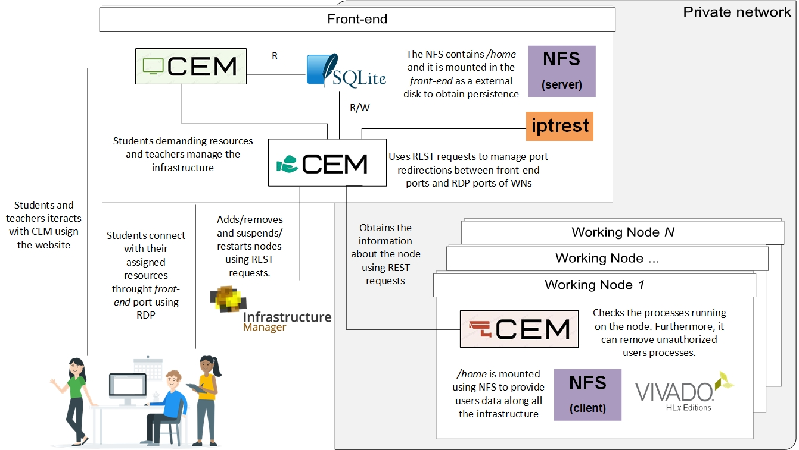
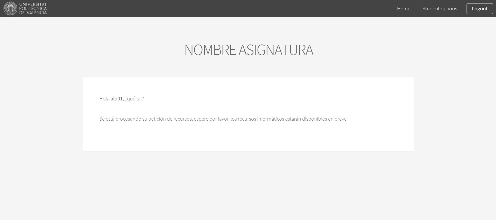
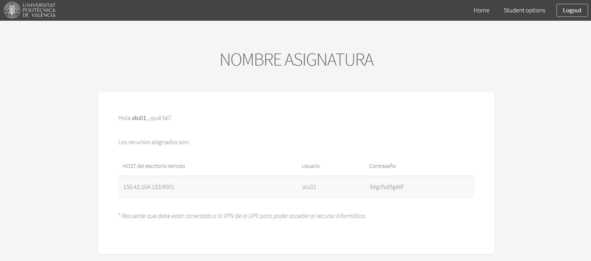
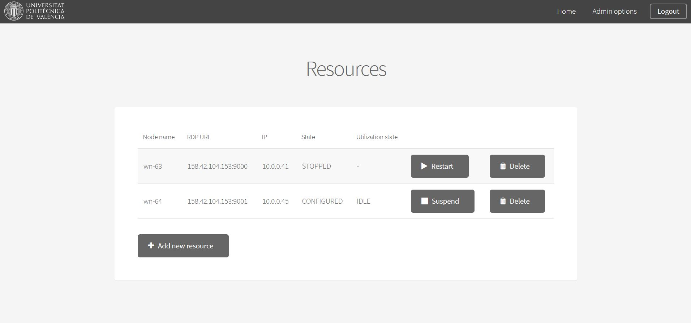
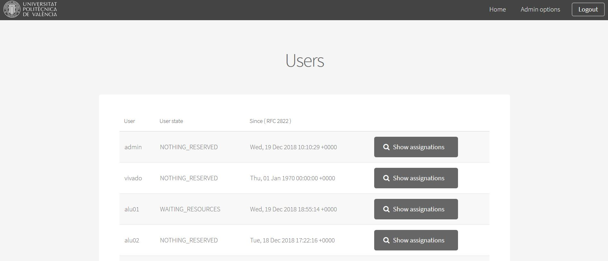
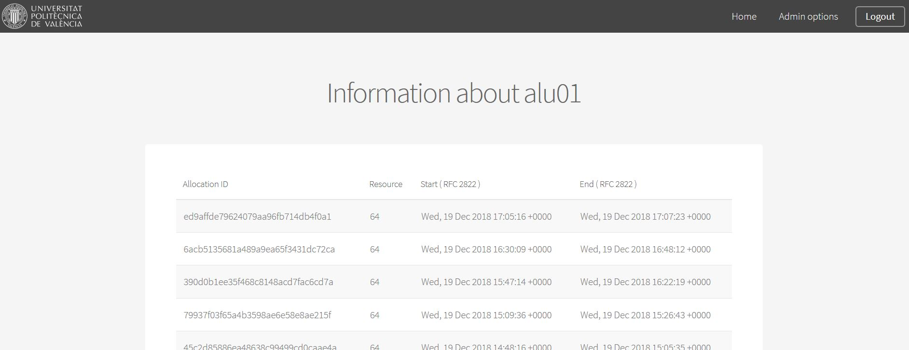
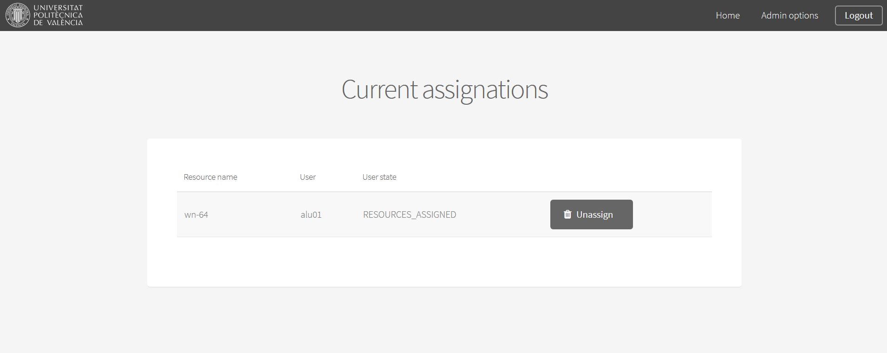

General architecture
=====================

.. 

__________

.. 

.. _iptrest: 
    https://github.com/grycap/iptrest

Cluster Elasticity Manager - Server (CEM)
==============================================

- CEM can maintain a `minimum number of resources` (nodes) in state `STOPPED` or IDLE.
- It is possible to define the `number of seconds` used by CEM to `consider that a user is INACTIVE`. Then, CEM releases the resources assigned to the user.
- It is possible to define the `number of seconds` used by CEM to `consider that a resource is IDLE too much time`. Then, CEM remove (or stop) the node.
- Modify the `periodicity` of:
    - Monitoring: check the resources and users state.
    - Manager: use the monitoring information for taking decisions about: releases and assigns resources to users, stops/restarts resources and adds/removes resources.
- Users have `three roles`: ADMINISTRATOR, TEACHER or STUDENT. The TEACHER users can `release resources assigned` to users, `stop/restart` resources and `add/remove` resources using the WEB interface. ADMINISTRATOR is in charge of deploy the CEM services.
- CEM `stores information about users`:
    - Timestamp start and finish for each assignation

Configuration variables in `cem.cfg`:
-------------------------------------
- `CEM_MAX_SLOTS_NODE` (default: 3): number of slots (users) allowed per node.
- `ALLOW_SLOTS_INACTIVE_TIME_SECONDS` (default: 600): amount of seconds that CEM allows users to stay in state RESOURCES_ASSIGNED state before release its reserved resources.
- `RESOURCE_IDLE_TIME_SECONDS` (default: 1800): amount of seconds that a resource must remain in state IDLE to remove it from the infrastructure.
- `MIN_RESOURCES_STOPPED` (default: 0): CEM will try to have this minimum number of nodes in state STOPPED.
- `MIN_RESOURCES_IDLE` (default: 0): CEM will try to have this minimum number of nodes in state IDLE.
- `REST_AGENT_API_SECRET`: token used for the authentication with CEM-Agents
- `IPTREST_RANGE_SOURCE_PORTS` (default: "9000, 9500"): the range of ports used by CEM for allowing the connectivity with the RDP ports of the working nodes. 
- .... and more variables but less interesting xD 

Before start-up:
-------------------------------------
- File with the working node recipe --> The filepath is defined in variable `WN_RADL_FILE` in /etc/cem/cem.cfg
- IM authentication file --> The filepath is defined in variable `IM_CREDENTIALS` in /etc/cem/cem.cfg
- Sqlite database with the Tables and users created  --> The filepath is defined in variable `DB` in /etc/cem/cem.cfg
- `IM_INFRASTRUCTURE_ID` and `IM_REST_ENDPOINT` must be valid.
- `PUBLIC_IP`: IP for RDP that acts as a proxy
- The service iptrest_ must be running.

Installation:
-------------------------------------
.. code-block:: bash

    cd cem_server && python setup.py install 

Start/stop service:
-------------------------------------
.. code-block:: bash

    service cem-start/stop
    systemctl start/stop cem

Enable/disable service:
-------------------------------------
.. code-block:: bash

    systemctl enable/disable cem
    chkconfig cem on/off

________

.. 

Cluster Elasticity Manager - Agent (CEM-Agent)
==============================================

- It checks if users are executing commands in the node every time that receives a request from CEM-Server. 
- It kills all processes of unauthorized users (the list is provided by CEM Server on each communication).

Configuration variables in `cem.cfg`:
-------------------------------------
- `REST_AGENT_API_SECRET`: token used for the authentication with CEM-Server

Installation:
-------------------------------------

.. code-block:: bash

    cd cem_agent && python setup.py install 

Start/stop service:
-------------------------------------
.. code-block:: bash

    service cem-agent start/stop
    systemctl start/stop cem-agent

Enable/disable service:
-------------------------------------
.. code-block:: bash

    systemctl enable/disable cem-agent
    chkconfig cem-agent on/off

_______

.. 

Website screenshots
===================

Students
--------

Before demanding resources
----------------------------

.. 

Waiting resources
-------------------------

.. 

With resources assigned
-------------------------

.. 

Teachers
==========

Current resources in the infrastructure
-----------------------------------------

.. 

Current state of all users
----------------------------

.. 

Assignations for user `alu01`
---------------------------------

.. 

Current asignations
-------------------------

.. 

